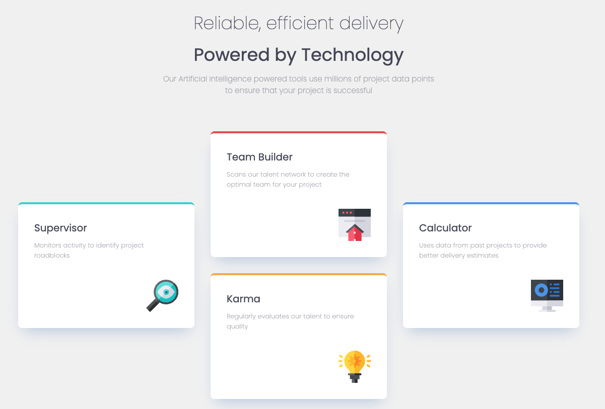
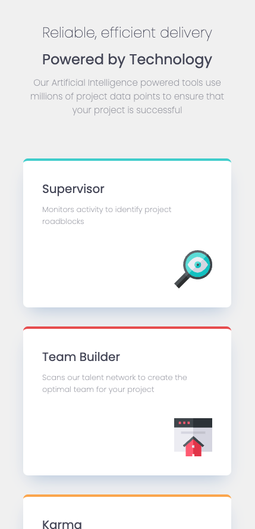

# Frontend Mentor - Four card feature section solution

This is a solution to the [Four card feature section challenge on Frontend Mentor](https://www.frontendmentor.io/challenges/four-card-feature-section-weK1eFYK). Frontend Mentor challenges help you improve your coding skills by building realistic projects. 

## Table of contents

- [Overview](#overview)
  - [The challenge](#the-challenge)
  - [Screenshot](#screenshot)
- [My process](#my-process)
  - [Built with](#built-with)
  - [What I learned](#what-i-learned)
## Overview

### The challenge

Users should be able to:

- View the optimal layout for the site depending on their device's screen size

### Screenshot





## My process

### Built with

- Flexbox
- CSS Grid
- SASS

### What I learned

Switching from multiple column layout on desktop to one column layout for mobile using a media query:

```css
.card-container {
  justify-content: center;
  display: grid;
  grid-template-rows: auto;
  grid-template-areas: "card-left card-middle card-right";
  column-gap: 32px;
  align-items: center;
}

@media (max-width: calc(350px * 3 + 2 * 32px)) {
  .card-container {
    grid-template-areas:
      "card-left"
      "card-middle"
      "card-right";
  }
}
```
